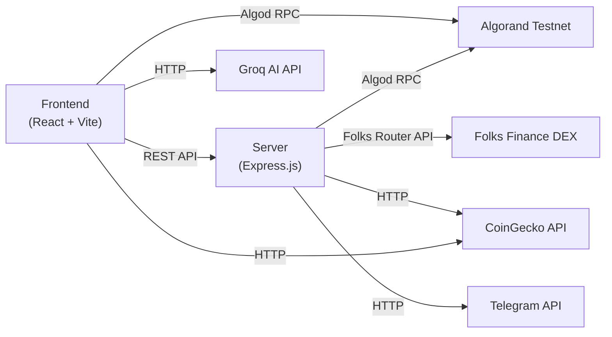
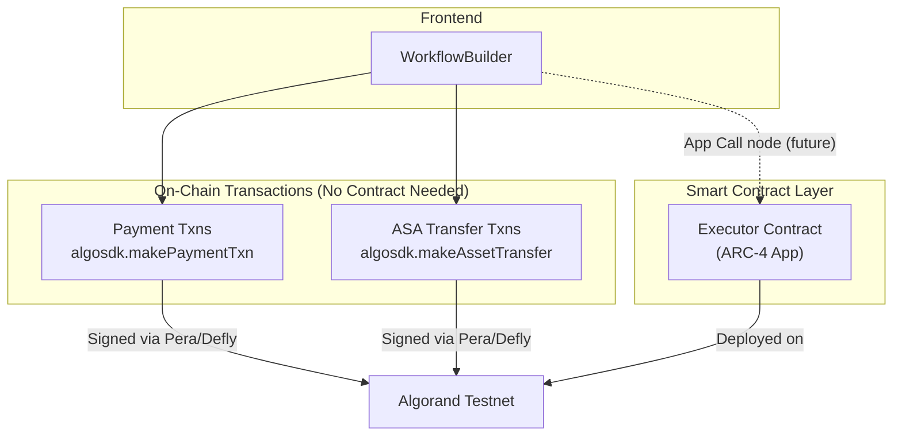
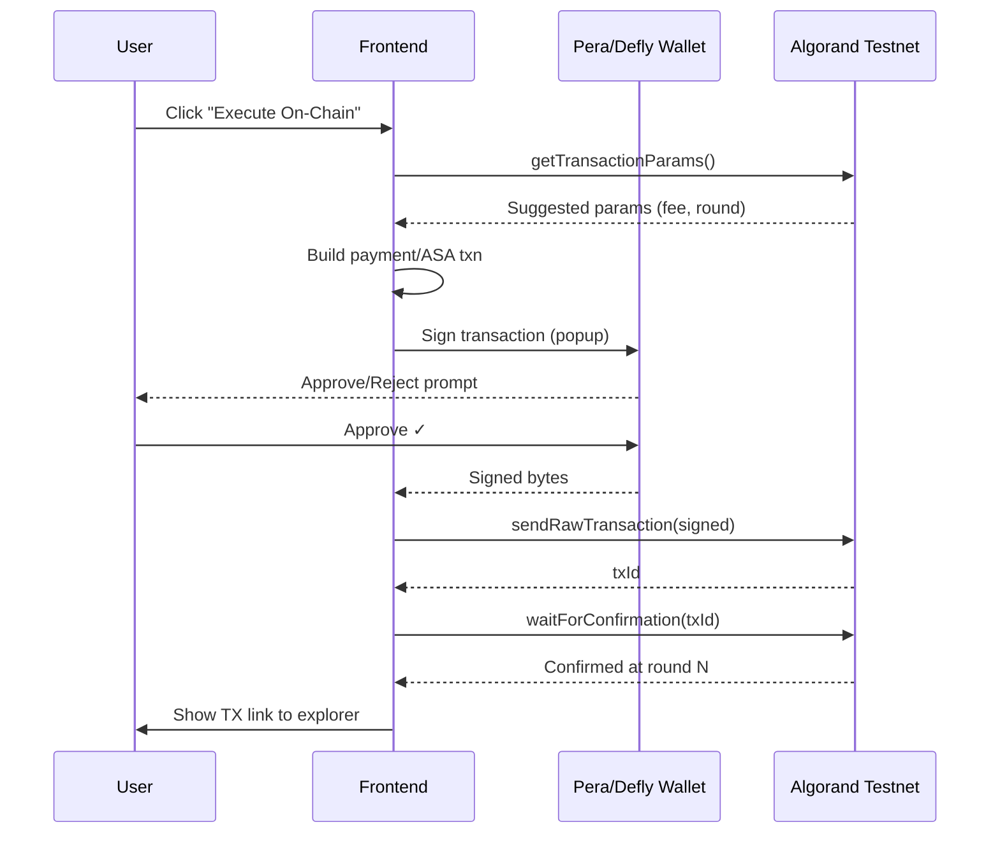
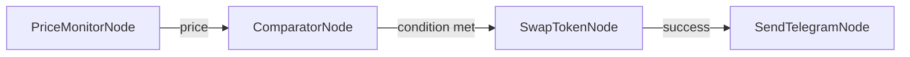
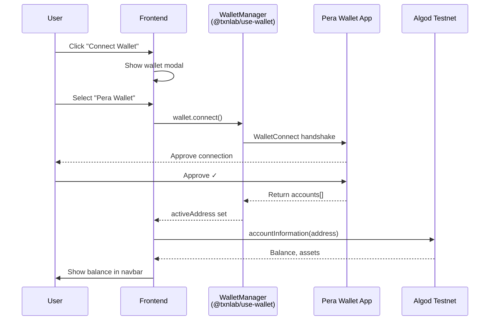
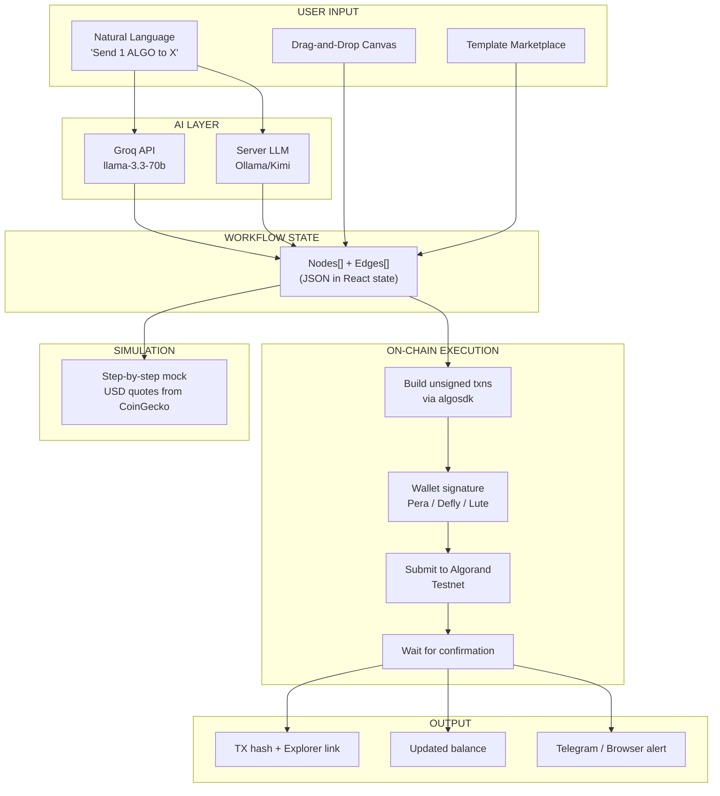

# MICROFLUX-X1 — Full Architecture & Smart Contract Walkthrough

## Overview

MICROFLUX-X1 is an **AI-powered visual workflow builder** for the **Algorand blockchain**. Users design automation workflows with drag-and-drop nodes, and the system can execute them on-chain via wallet signing (Pera / Defly / Lute).

The project is a **monorepo** with 3 independent modules:



---

## 1. Smart Contracts

### 1.1 Executor Contract (The Only Smart Contract)

| Property | Value |
|----------|-------|
| **File** | [contract.py](file:///Users/somesh.s.talligeri/Downloads/microflux/projects/microflux-contracts/smart_contracts/executor/contract.py) |
| **Language** | Algorand Python (algopy) |
| **Type** | ARC-4 Application |
| **App ID** | Not yet deployed (template only) |
| **Status** | Starter / Placeholder |

```python
from algopy import ARC4Contract, String
from algopy.arc4 import abimethod

class Executor(ARC4Contract):
    @abimethod()
    def hello(self, name: String) -> String:
        return "Hello, " + name
```

> [!IMPORTANT]
> This is currently a **starter contract** from the AlgoKit template. It has a single `hello` method for verification. The actual workflow execution happens **off-chain** in the frontend/server, with only payment/ASA transfer transactions going on-chain via wallet signing.

### 1.2 How the Contract Fits In



**Key insight:** Most MICROFLUX workflows use **native Algorand transactions** (payments, ASA transfers) that don't require a smart contract. The Executor contract exists for the `App Call` node type, which allows users to call arbitrary smart contract methods.

---

## 2. Full System Architecture

### 2.1 Three-Module Structure

```
microflux/
├── projects/
│   ├── microflux-contracts/     ← Smart contract (Algorand Python)
│   │   └── smart_contracts/
│   │       ├── executor/
│   │       │   ├── contract.py       ← The ARC-4 contract
│   │       │   └── deploy-config.ts  ← Deployment script
│   │       ├── __main__.py           ← Build & compile orchestrator
│   │       └── index.ts              ← Deploy runner
│   │
│   └── microflux-frontend/      ← React frontend (what users see)
│       └── src/
│           ├── services/         ← Core business logic
│           │   ├── walletService.ts     ← Algod client, txn signing
│           │   ├── aiService.ts         ← Groq AI integration
│           │   ├── marketService.ts     ← CoinGecko price feeds
│           │   ├── templateService.ts   ← Pre-built workflow templates
│           │   └── nodeDefinitions.ts   ← 16 drag-and-drop node types
│           ├── components/       ← UI components
│           └── App.tsx           ← Wallet provider setup
│
└── server/                      ← Express.js backend (separate)
    └── src/
        ├── core/
        │   ├── engine/
        │   │   ├── algorand.ts       ← Algod client for server
        │   │   ├── folksRouter.ts    ← DEX swap via Folks Router
        │   │   └── runner.ts         ← Workflow execution engine
        │   ├── integrations/
        │   │   ├── coingecko.ts      ← Price fetching
        │   │   └── telegram.ts       ← Alert notifications
        │   ├── ai/
        │   │   └── prompts.ts        ← LLM system prompt
        │   └── llmClient.ts          ← Ollama/Kimi LLM connection
        └── controllers/
            ├── intent.controller.ts  ← Natural language → workflow JSON
            └── execute.controller.ts ← Server-side workflow runner
```

---

## 3. Frontend Services — Detailed Breakdown

### 3.1 walletService.ts — On-Chain Connection

| Feature | Implementation |
|---------|---------------|
| **Algod Client** | `algosdk.Algodv2` connecting to `https://testnet-api.algonode.cloud` |
| **Balance Fetch** | `algod.accountInformation(address).do()` with 3-retry logic |
| **Asset Fetch** | Same endpoint, parses `assets` array from account info |
| **Send Payment** | `algosdk.makePaymentTxnWithSuggestedParamsFromObject()` → wallet signs → `algod.sendRawTransaction()` → `waitForConfirmation()` |
| **ASA Transfer** | `algosdk.makeAssetTransferTxnWithSuggestedParamsFromObject()` → same signing flow |
| **Health Check** | `algod.status().do()` to verify Testnet reachability |

**Transaction Flow:**


### 3.2 aiService.ts — AI Workflow Generation

| Feature | Implementation |
|---------|---------------|
| **AI Provider** | Groq API (`https://api.groq.com/openai/v1`) |
| **Model** | `llama-3.3-70b-versatile` |
| **Input** | Natural language description |
| **Output** | Strict JSON: `{ nodes[], edges[], explanation }` |
| **Safety** | Rate limiting (1 call/3s), schema validation, never executes transactions |

**AI Pipeline:**
```
User types: "Send 1 ALGO to address X every hour"
     ↓
Groq API (llama-3.3-70b-versatile)
     ↓
JSON response:
{
  nodes: [
    { type: "timer_loop", config: { interval: 3600000 } },
    { type: "send_payment", config: { amount: 1000000, receiver: "X" } }
  ],
  edges: [{ source: "node_1", target: "node_2" }],
  explanation: "Timer triggers every hour, then sends 1 ALGO..."
}
     ↓
Schema validation → Load into Canvas
```

### 3.3 marketService.ts — Price Data

| Feature | Implementation |
|---------|---------------|
| **API** | CoinGecko Public API (free, no key) |
| **Caching** | 45-second TTL to avoid rate limits |
| **Tokens** | ALGO, BTC, ETH, USDC |
| **Usage** | USD value estimation during simulation, Market Data page |

### 3.4 templateService.ts — Pre-Built Workflows

6 templates across 4 categories:

| Template | Category | Nodes | Status |
|----------|----------|-------|--------|
| Simple Payment | Payments | 2 | Real |
| Multi-Recipient Payment | Payments | 4 | Real |
| Treasury Distribution | Treasury | 5 | Real |
| Price Alert | Trading | 3 | Mock |
| DCA Strategy | Trading | 4 | Mock |
| Auto-Notify | Automation | 3 | Mixed |

### 3.5 nodeDefinitions.ts — 16 Node Types

| Node | Category | `isReal` | What It Does |
|------|----------|----------|-------------|
| Timer Loop | Trigger | ❌ Mock | Fires at intervals (UI only) |
| Wallet Event | Trigger | ❌ Mock | Triggers on wallet activity |
| Webhook Trigger | Trigger | ❌ Mock | HTTP endpoint trigger |
| **Send Payment** | Action | ✅ Real | `algosdk.makePaymentTxn` → wallet sign → submit |
| **ASA Transfer** | Action | ✅ Real | `algosdk.makeAssetTransferTxn` → wallet sign → submit |
| **App Call** | Action | ✅ Real | Calls smart contract method (Executor) |
| HTTP Request | Action | ❌ Mock | External API call |
| Delay | Logic | ❌ Mock | `setTimeout()` wait |
| Filter/Condition | Logic | ❌ Mock | Branch based on conditions |
| Debug Log | Logic | ❌ Mock | `console.log()` |
| Get Quote | DeFi | ❌ Mock | CoinGecko price fetch |
| Price Feed | DeFi | ❌ Mock | Continuous price monitoring |
| **Browser Notification** | Notification | ✅ Real | `new Notification()` via Web API |
| Telegram Notify | Notification | ❌ Mock | Telegram bot message |
| Discord Notify | Notification | ❌ Mock | Discord webhook |

> [!NOTE]
> **Real** nodes execute actual transactions or actions. **Mock** nodes simulate behavior in the UI for demo purposes. Mock nodes can be upgraded to real by implementing their backend logic.

---

## 4. Server-Side Engine

### 4.1 Intent Parser (AI → Workflow)

[intent.controller.ts](file:///Users/somesh.s.talligeri/Downloads/microflux/server/src/controllers/intent.controller.ts) — Uses an LLM (Ollama/Kimi) to convert natural language into a workflow graph:

```
POST /api/intent
Body: { "prompt": "Monitor ALGO price and swap to USDC when above $0.50" }
Response: { nodes: [...], edges: [...] }
```

### 4.2 Workflow Execution Engine

[execute.controller.ts](file:///Users/somesh.s.talligeri/Downloads/microflux/server/src/controllers/execute.controller.ts) — Executes workflow nodes in sequence:



Execution steps:
1. **PriceMonitorNode** → Fetches real price from CoinGecko
2. **ComparatorNode** → Evaluates condition (e.g., `price > 0.50`)
3. **SwapTokenNode** → Prepares swap via Folks Router API (returns unsigned txn for wallet)
4. **SendTelegramNode** → Sends alert via Telegram Bot API

### 4.3 Folks Router Integration (DEX Swaps)

[folksRouter.ts](file:///Users/somesh.s.talligeri/Downloads/microflux/server/src/core/engine/folksRouter.ts) — Interacts with Folks Finance DEX:

| Asset | ASA ID |
|-------|--------|
| ALGO | 0 (native) |
| USDC | 31566704 |
| USDT | 312769 |

```
GET https://api.folks.finance/v1/router/quote
    ?fromAsset=0&toAsset=31566704&amount=1000000&type=fixed-input
```

---

## 5. Wallet Integration

### 5.1 Supported Wallets

| Wallet | ID | Network | Type |
|--------|-----|---------|------|
| **Pera Wallet** | `WalletId.PERA` | Testnet/Mainnet | Mobile + Web |
| **Defly Wallet** | `WalletId.DEFLY` | Testnet/Mainnet | DeFi-focused |
| **Lute Wallet** | `WalletId.LUTE` | Testnet/Mainnet | Browser extension |
| KMD | `WalletId.KMD` | LocalNet only | Development |

### 5.2 Connection Flow



---

## 6. Network Configuration

### Current (Testnet):
```env
VITE_ALGOD_SERVER=https://testnet-api.algonode.cloud
VITE_ALGOD_PORT=""
VITE_ALGOD_TOKEN=""
VITE_ALGOD_NETWORK=testnet
VITE_INDEXER_SERVER=https://testnet-idx.algonode.cloud
```

### Server-side (hardcoded):
```typescript
// server/src/core/engine/algorand.ts
const ALGO_SERVER = "https://testnet-api.algonode.cloud";
export const algoClient = new algosdk.Algodv2("", ALGO_SERVER, "");
export const indexerClient = new algosdk.Indexer("", "https://testnet-idx.algonode.cloud", "");
```

> [!TIP]
> AlgoNode endpoints are **free, no API key required**, and support both Testnet and Mainnet.

---

## 7. Complete Execution Flow (End-to-End)



---

## 8. What's Real vs. What's Mock

| Component | Status | Details |
|-----------|--------|---------|
| Pera/Defly wallet connection | ✅ Real | Connects to real Testnet accounts |
| Account balance display | ✅ Real | Live Algod query |
| Send Payment (ALGO) | ✅ Real | Real Testnet transactions |
| ASA Transfer | ✅ Real | Real on-chain transfers |
| Browser Notifications | ✅ Real | Web Notification API |
| CoinGecko prices | ✅ Real | Live market data |
| AI workflow generation (Groq) | ✅ Real | Live API calls |
| Executor smart contract | ⚠️ Placeholder | `hello()` method only, not deployed |
| Timer/Webhook triggers | ❌ Mock | UI-only simulation |
| Telegram/Discord alerts | ❌ Mock | Requires bot tokens |
| Folks Router swaps | ❌ Mock | API prepared but not fully connected |
| App Call node | ⚠️ Partial | Framework exists, needs contract deployment |

---

## 9. Key Design Decisions

1. **No smart contract needed for most workflows** — Payments and ASA transfers are native Algorand L1 transactions. The Executor contract is reserved for complex on-chain logic.

2. **AI is assistive only** — AI generates workflow JSON but never signs or submits transactions. The user must explicitly click "Execute" and approve via their wallet.

3. **Client-side transaction building** — Transactions are built in the browser using `algosdk`, signed via the wallet provider, and submitted directly to Algod. The server is only needed for AI intent parsing and DEX swap preparation.

4. **Wallet abstraction via `@txnlab/use-wallet`** — A single `transactionSigner` interface works across Pera, Defly, and Lute without wallet-specific code.
